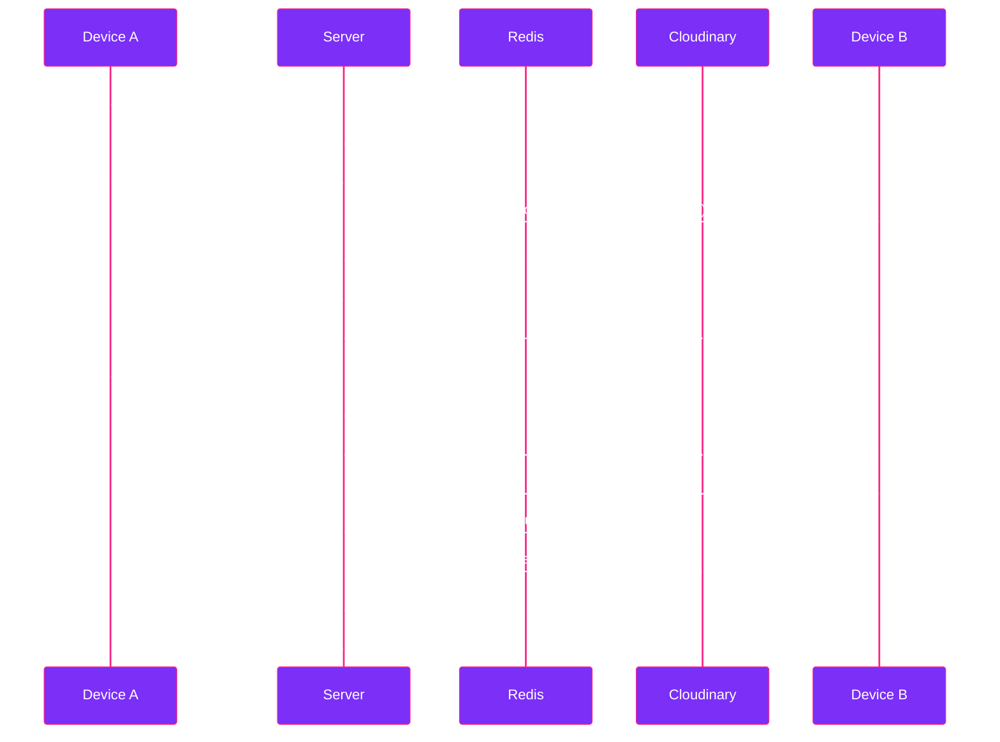

<div align="center">


<br/>


<br/><br/>

[](#)
[](#)
[](#)
[](#)
[](#)
[](#)

<br/>

<a href="https://dropspacee.netlify.app/">Overview</a> &nbsp;·&nbsp;
<a href="#features">Features</a> &nbsp;·&nbsp;
<a href="#architecture">Architecture</a> &nbsp;·&nbsp;
<a href="#setup">Setup</a> &nbsp;·&nbsp;
<a href="#roadmap">Roadmap</a> &nbsp;·&nbsp;
<a href="#license">License</a>

</div>

<br/>


<br/>

## Overview

dropSpace is a real-time, cross-device clipboard and media vault. Open it on a laptop and a phone, pair the two with a short room code, and anything typed, pasted, or dropped on one device appears on the other within moments — no accounts, no installs, nothing to configure.

It was built to remove the small daily friction of moving a link, a snippet, or a photo between your own devices, without relying on chat apps or email as a workaround.

<br/>

<div align="center">

</div>

<br/>

## Features

<table width="100%">
<tr>
<td width="50%" valign="top">

<h3>Text and Clipboard Hub</h3>

<ul>
<li>Type or paste text, links, or code from either device</li>
<li>Automatic syntax highlighting for detected code</li>
<li>One-tap copy to system clipboard</li>
<li>Live character count while typing</li>
<li><code>Cmd / Ctrl + Enter</code> to send instantly</li>
</ul>

</td>
<td width="50%" valign="top">

<h3>Media Vault</h3>

<ul>
<li>Drag-and-drop photo and video uploads, up to 50MB</li>
<li>Live per-file upload progress</li>
<li>Grid preview with playable video thumbnails</li>
<li>One-click download on the receiving device</li>
<li>Streams directly to Cloudinary — never touches disk</li>
</ul>

</td>
</tr>
<tr>
<td width="50%" valign="top">

<h3>Instant Pairing</h3>

<ul>
<li>Auto-generated six-character room code, ambiguous characters excluded</li>
<li>QR code pairing between phone and laptop in a single scan</li>
<li>Live confirmation the moment a second device joins</li>
<li>Connected-devices list, shown by name, not just a count</li>
</ul>

</td>
<td width="50%" valign="top">

<h3>Ephemeral by Design</h3>

<ul>
<li>Every item expires automatically after twenty-four hours</li>
<li>Manual "destruct space" action clears text and media on demand</li>
<li>No accounts, no persistent identity, nothing left behind</li>
</ul>

</td>
</tr>
</table>

<br/>

## Design language

<div align="center">

<table>
<tr>
<td align="center" width="33%">
<br/>
<code>#D4AF37</code><br/>Gold
</td>
<td align="center" width="33%">
<br/>
<code>#F72585</code><br/>Pink
</td>
<td align="center" width="33%">
<br/>
<code>#7B2FF7</code><br/>Purple
</td>
</tr>
</table>

</div>

Dark canvas, glass panels, and a gradient sync beam running gold through pink into purple beneath the interface — a visual cue that intensifies the moment a second device pairs, so the UI reflects a genuinely live connection rather than a static layout.

<br/>

<details>
<summary><b>Architecture — expand for the full stack breakdown</b></summary>

<br/>

<table width="100%">
<tr><th align="left">Layer</th><th align="left">Choice</th><th align="left">Purpose</th></tr>
<tr><td>Frontend framework</td><td>React + Vite</td><td>Component UI, fast local iteration</td></tr>
<tr><td>Styling</td><td>Tailwind CSS</td><td>Custom glassmorphism theme</td></tr>
<tr><td>Realtime client</td><td>socket.io-client</td><td>Bi-directional device sync</td></tr>
<tr><td>Hosting (frontend)</td><td>Netlify</td><td>Static build delivery</td></tr>
<tr><td>Runtime</td><td>Node.js + Express</td><td>HTTP and upload handling</td></tr>
<tr><td>Realtime server</td><td>socket.io</td><td>Room, presence, and sync events</td></tr>
<tr><td>File handling</td><td>Multer, in-memory</td><td>Streams uploads with no disk writes</td></tr>
<tr><td>Media storage</td><td>Cloudinary</td><td>Persistent hosting for photos and video</td></tr>
<tr><td>Ephemeral state</td><td>Redis</td><td>Rooms, device presence, twenty-four-hour history</td></tr>
<tr><td>Hosting (backend)</td><td>Render</td><td>Persistent Node process for WebSockets</td></tr>
</table>

</details>

<br/>

## Architecture



<br/>

## Setup

```bash
git clone https://github.com/gopika-R2410/dropSpace.git
cd dropSpace

cd server
cp .env.example .env
npm install
npm run dev
```

```bash
cd ../client
cp .env.example .env
npm install
npm run dev
```

Open the client URL on two devices, pair with the room code or QR, and begin syncing.

<br/>

<details>
<summary><b>Environment variables — expand to view</b></summary>

<br/>

**`server/.env`**
```env
PORT=5000
CLIENT_ORIGIN=http://localhost:5173
REDIS_URL=redis://...
CLOUDINARY_CLOUD_NAME=...
CLOUDINARY_API_KEY=...
CLOUDINARY_API_SECRET=...
ROOM_TTL_SECONDS=86400
```

**`client/.env`**
```env
VITE_SERVER_URL=http://localhost:5000
```

</details>

<br/>

## Project structure

```
dropSpace/
├── client/                 React + Vite frontend
│   └── src/
│       ├── components/     Header, RoomConnect, TextVault, MediaVault, Dropzone
│       ├── context/        SocketContext, RoomContext
│       ├── hooks/          useSocket, useClipboard
│       └── utils/          deviceName generator
└── server/                 Node.js + Express backend
    ├── config/              redis.js, cloudinary.js
    ├── controllers/         uploadController.js
    ├── sockets/             roomHandler.js
    └── middleware/          multer.js
```

<br/>

## Roadmap

- Clipboard-image paste directly onto the canvas
- End-to-end encrypted rooms
- Installable progressive web app for one-tap re-pairing
- Small group rooms beyond a single pair of devices

<br/>

## Contributing

Issues and pull requests are welcome. If something is unclear or broken, opening an issue is the fastest way to get it addressed.

<br/>

## License

Released under the MIT License.

<br/>

<div align="center">

<sub>Built by <a href="https://github.com/gopika-R2410">Gopika R</a></sub>


</div>
